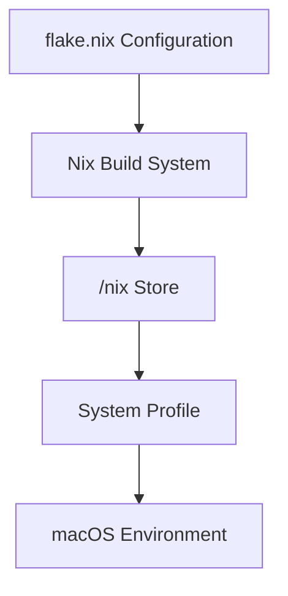
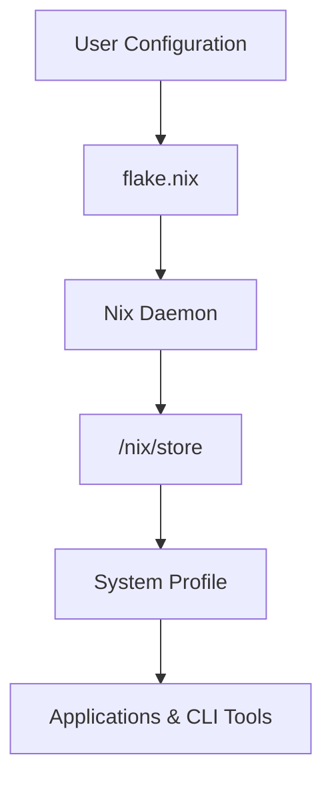
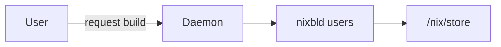

# I declare Nix-Darwin for the laptop win
{.center}

{ .center width="200" }

For most Mac users the standard way to install developer  and unix tools is **[Homebrew](https://brew.sh)** or  **[MacPorts](https://www.macports.org)**.  I used MacPorts or years and it works well but had its pain points so switch to Homebrew as it had a large following, but eventually I ran into the same familiar problem:

- machines drift over time
- dependencies break
- reproducing a setup on a new laptop is painful

What I wanted instead was something closer to *infrastructure-as-code* for my laptop.  This  is exactly what **Nix and Nix-Darwin** provide.

Instead of manually installing packages one-by-one, I define my entire macOS environment in a *single configuration file*. 

If I buy a new Mac tomorrow, I can rebuild the same environment by simply declaring the desired state using a version controlled and backed up configuration file

---

## What Does Nix Brings to the Table 

Traditional method using Homebrew/MacPorts as  package managers modify the system incrementally.

```bash
brew install git
brew install neovim
brew install ripgrep
```

Over time my environment accumulates state that is difficult to track.

Nix flips that model. Instead of changing the system directly, it builds (*declares*) a system environment state.



>[!info] The Skinny!
>Every configuration change builds a new **generation**  of system state version.
>This means the system can roll back instantly if something breaks.

## Architecture Overview
Understanding the basic Nix architecture helps explain why it is so reliable.



## So...What is this?

Key concepts:
- flake.nix defines the system
- Nix daemon performs builds in isolation
- /nix/store contains immutable packages
- Profiles assemble packages into a usable system

## Installing Nix: Security First

First, we need the Nix package manager itself.  While the official installer is available, the **[Determinate Systems Nix-Installer](https://github.com/DeterminateSystems/nix-installer?tab=readme-ov-file)** has become a go to standard for its reliability on modern macOS versions and its seamless handling of Apple's read-only root partition. 

Installation guides suggest this:

```bash
curl --proto '=https' --tlsv1.2 -sSf -L \
https://install.determinate.systems/nix | sh -s -- install
```

>[!WARNING]
>Piping scripts directly into a shell bypasses most verification controls.
>Always inspect installation scripts before executing them.

I prefer not to run remote scripts blindly.  It is recommended to use to following workflow 

**download → inspect → execute**

### Download the installer

```bash
curl -L https://install.determinate.systems/nix -o nix-installer
chmod +x nix-installer
```

### Inspect the script
Open the scrip and look for any nefarious commands (rm -rf /\*)  or calls to IP address etc. If not sure, get your friendly neighbourhood LLM to give a once over and report.

### Run explain mode
The Determinate Systems Installer includes a built-in safety feature. Run the installer with the `--explain` flag.  This will output exactly what changes will be made for review **without actually performing them**.
```bash
./nix-installer install --explain
````

### Once satisfied...Install away
```bash
sudo ./nix-installer install
```

After installation restart your terminal to load in the new env variables and $PATH

**Why does Nix on macOS Require sudo?**
In macOS 26, the `nix` command and `darwin-rebuild` require `sudo`.  This is not a bug; it is a security feature.  By using a **Multi-User Daemon**, Nix ensures that package builds happen in a restricted environment, preventing a malicious package from accessing your personal documents.



***Why Like This?***
This design improves security because the builds run as the isolated builder user rather than your personal account.

>[!TIP]
>Although sudo is required for system rebuilds, you can enable Touch ID authentication so rebuilds only require a fingerprint.
>This can be configure easily using Nix

## Bootstrapping Nix-Darwin
In 2026, **Flakes** are the default way to manage Nix. They ensure your setup is locked to specific versions, making it 100% reproducible.

Once Nix is installed, create  the Nix-Darwin configuration directory and initialise a new flake:

```bash
mkdir -p ~/.config/nix-darwin
cd ~/.config/nix-darwin
sudo nix flake init -t nix-darwin
```
This generates a ~/.config/nix-darwin/flake.nix file.  This will be the main file edited to setup MacOS environments and manage packages.

### My Personal flake.nix Configuration
Below is my configuration I use on my Apple Silicon MacBook.
I have added comments so that future me , or anyone else reading, understands what is happening.
```nix
{
# The description helps identify this flake when running nix commands
  description = "MikeBook system flake";

# 'Inputs' are the dependencies of your configuration. 
# These are like a 'requirements.txt' or 'package.json' for the entire OS.
  inputs = {
    #We pull from 'nixpkgs-unstable' to get the latest versions
    nixpkgs.url = "github:NixOS/nixpkgs/nixpkgs-unstable";

    # Nix-Darwin allows Nix to manage macOS configuration
    nix-darwin.url = "github:nix-darwin/nix-darwin/master";

    # Utility to make GUI applications installed by Nix appear
    # in Spotlight and the macOS Applications folder
    mac-app-util.url = "github:hraban/mac-app-util";

    # Ensure nix-darwin uses the same nixpkgs revision
    # This prevents 'version mismatch' headaches.
    nix-darwin.inputs.nixpkgs.follows = "nixpkgs";
  };
  # 'Outputs' is where we define what the flake actually produces (in this case, a system config).  
  outputs = inputs@{ self, nix-darwin, nixpkgs, mac-app-util, ... }:

  let
    # Apple Silicon architecture
    system = "aarch64-darwin";

    configuration = { pkgs, ... }: {
      #################################
      # Custom Overlay
      #################################

      # Overlays allow custom packages or modified versions
      # of existing packages.
      # In this case I pin a specific version of tree-sitter for 
      # Neovim to prevent breaking changes.
      nixpkgs.overlays = [
        (final: prev: {
          tree-sitter-261 = prev.rustPlatform.buildRustPackage rec {

            pname = "tree-sitter";
            version = "0.26.1";
    			
    		 # Fetching source directly from GitHub 	
            src = prev.fetchFromGitHub {
              owner = "tree-sitter";
              repo = "tree-sitter";
              rev = "v${version}";
              hash = "sha256-k8X2qtxUne8C6znYAKeb4zoBf+vffmcJZQHUmBvsilA=";
            };
    		 # Checksums for the Rust/Cargo dependencies 	
            cargoHash = "sha256-hnFHYQ8xPNFqic1UYygiLBWu3n82IkTJuQvgcXcMdv0=";

            cargoBuildFlags = [ "-p" "tree-sitter-cli" ];
            doCheck = false;

            meta.mainProgram = "tree-sitter";
          };
        })
      ];

      #################################
      # Nix Settings
      #################################

  		nix.settings = {
  		   # Enable Flakes and the 'nix' command (required for modern Nix usage).
      	  experimental-features = "nix-command flakes";
      	 	auto-optimise-store = true;
    	  	sandbox = true; # Security Hardening
    	};
          
        # Biometric security for CLI commands
        security.pam.enableSudoTouchIdAuth = true;
        # Allow the installation of non-open-source software (like Obsidian).
        nixpkgs.config.allowUnfree = true;

      #################################
      # Installed Packages
      #################################
      # This is the applications to install. Remove from the list and it is uninstalled
      environment.systemPackages = with pkgs; [
        # CLI quality of life
        bat
        eza
        fd
        fzf
        ripgrep
        zoxide
        oh-my-posh
        raycast

        # Development tools
        neovim
        nodejs_24
        python314
        go

        # Terminals
        wezterm
        kitty

        # Utilities
        tmux
        btop
        glow
        stow
        powershell

        # Notes management
        obsidian

        # Static site generation
        hugo

        # Containers
        podman
        podman-desktop
        podman-compose
        kubectl

        # Browsers
        firefox

        # macOS clipboard support for neovim
        reattach-to-user-namespace

        # custom overlay to pin neovim dependency
        tree-sitter-261
      ];

      #################################
      # Fonts
      #################################
      # Installs Nerd Fonts required for Oh-My-Posh and Neovim/tmux icons.
      fonts.packages = with pkgs; [
        nerd-fonts.jetbrains-mono
        nerd-fonts.meslo-lg
      ];

      #################################
      # Shell Configuration
      #################################

      programs.zsh.enable = true;

      #################################
      # System Attributes
      #################################
      # This helps you know which version of the config is currently active.
      system.configurationRevision = self.rev or self.dirtyRev or null;
      
      # DO NOT CHANGE: This is the Nix-Darwin release version. 
      # It manages internal compatibility.
      system.stateVersion = 6;
      # Ensure Nix knows we are building for Apple Silicon.
      nixpkgs.hostPlatform = system;
    };

  in {
    darwinConfigurations."MikeBook" =
      nix-darwin.lib.darwinSystem {

        modules = [
          configuration
          mac-app-util.darwinModules.default
        ];

        specialArgs = { inherit inputs; };
      };
    # Expose the package set for external use if needed.
    darwinPackages =
      self.darwinConfigurations."MikeBook".pkgs;
  };
}
```

**Applying the initial setup/bootstrap configuration**
With a flake.nix configured it is now time to complete the bootstrapping of the initial setup and build the first Nix-Darwin environment generation.

To activate the configuration run:
```bash
sudo nix run nix-darwin -- switch --flake ~/.config/nix-darwin#MikeBook
```
This is a "meta-command." It tells Nix to download a fresh copy of the nix-darwin builder itself and run it immediately. It is primarily used the very first time you set up a Mac (before the *darwin-rebuild* command exists on the system) or if the local installation becomes corrupted.

As mentioned before, each rebuild creates a new system environment *generation*.

###  Managing Software with Nix-Darwin
With a working Nix/Nix-Darwin environment,  future system changes and application installations and removals are declared as a desired state in the flake.nix file and applied using the CLI, primarily the `nix flake` or `darwin-rebuild commands`

---
The main commands to **get stuff done ™**
-  **`nix flake update`** is like running `brew update`.  It looks at your "sources" (like GitHub) and updates the version numbers in your `flake.lock` file. **It does not change your system.**
-  **`darwin-rebuild switch`** is like running `brew upgrade`. It reads your `flake.nix` and `flake.lock`, builds the software, and **actually changes your system.**

`nix flake update`
The "Source Synchroniser"
This command is purely about metadata and versioning.  It reaches out to the internet to check if there are newer versions of the inputs you defined in your flake.nix (like nixpkgs).  It then updates your flake.lock file with the specific commit hashes of those new versions.

`darwin-rebuild switch`
The "Daily Driver"
This is your primary tool for applying changes.  It reads your flake.nix and flake.lock, downloads or builds the necessary packages, and updates your macOS system links to match that configuration.

`nix run nix-darwin -- switch`
The "Bootstrap & Recovery" Tool
This is a "meta-command."  It tells Nix to download a fresh copy of the nix-darwin builder itself and run it immediately.  It is primarily used the very first time you set up a Mac (before the darwin-rebuild command even exists) or *if your local installation becomes corrupted.*

---
**My  Workflow**
To maintain my Mac state, that add/remove software etc, I follow this  "Update & Apply" process:
1. Stage the updates:
```bash
sudo nix flake update --flake /Users/mike/.config/nix-darwin/
```

2. Audit the change (Optional but recommended):
Check which versions changed in your flake.lock or run a dry-run:
```bash
sudo darwin-rebuild build --flake "/Users/mike/.config/nix-darwin#MikeBook" 
```

3. Apply the changes:
```bash
sudo darwin-rebuild switch --flake "/Users/mike/.config/nix-darwin#MikeBook"
```

**Rollback Safety**
If something goes wrong, restoring system state to the previous working on is as easy as:
```bash
darwin-rebuild --rollback
```
Nix will immediately will do the heavy lifting to revert to the previous working configuration.

>[!INFO]
>This is one of the most powerful features of Nix.
>Breaking your system configuration is no longer catastrophic because every generation is preserved.

### Don't Touch nix.conf
When Nix is installed (not to be confused with Nix-Darwin but both are bootstrapped at installation), It installs a (single user mode) ~/.config/nix/nix.conf file.  You’ll notice the `nix.conf` says: *Do not edit it!*.  In a `nix-darwin` setup,  nix settings are defined in the `flake.nix`,  and Nix-Darwin generates the file for you. If you edit `nix.conf` manually, the next rebuild will just overwrite the changes.

### The "Homebrew" Hybrid...if needed
If there are specific GUI apps or Mac App Store apps that Nix doesn't handle perfectly, Nix-Darwin has a built-in **Homebrew module**. This allows [Casks](https://github.com/Homebrew/homebrew-cask) (to be honest are preaty cool) to be listed  in the flake.nix file, letting Nix "manage" Homebrew and App Store application.

## Why I'm Sold on Nix-Darwin
Moving from Homebrew to Nix-Darwin fundamentally changed how I manage software and configure ephemeral environments (dev without clash or pollution) on my  Mac.

Instead of treating my laptop as a fragile setup, it becomes something closer to a reproducible system build.

The benefits to me are significant:
- deterministic builds
- version controlled configuration
- easy migration to new machines
- instant and clean rollback
For developers, engineers, or anyone who value reproducibility, Nix-Darwin turns macOS systems  into something much closer to *[infrastructure-as-code](https://en.wikipedia.org/wiki/Infrastructure_as_code)* for your laptop.

---
### Resources that I followed
Apart from the obvious project sites as the source of truth for Nix and Nix-Darwin. I found the following sites and videos very helpful

[Nix Darwin Official Page](https://nix-darwin.org/)

[Nix..the package manager for NixOS](https://nixos.org)

I found Michael's video a good, recent, walkthrough  and the problem he was trying to solve shared a lot similarities with mine, and I guess other MacPorts and Homebrew users as well.  He goes through using the Determinate Systems installer for better macOS upgrade resilience and and  steps for handling unfree software through specific "predicates".


Omer provides shows his process for converting manual macOS settings into a declarative Nix flake.  He goes through how to automate system preferences like Touch ID for `sudo`, integrating Homebrew for GUI app management, and how to navigate the extensive nix-darwin documentation to build a portable, "code-driven machine configuration".  His other videos are good watch as well. 


Alex from KTZ Systems explains the mechanics of the Nix store and symlink architecture.  He focuses on building a unified, cross-platform workflow that he uses for managing macOS and Linux systems from a single flake, using modular logic to apply custom settings like dock layouts to specific machines. His guid on using and the Mac App Store and solutions for common hurdles like Full Disk Access and Rosetta installation was very helpfull.  His other videos, mainly on tailscale are also a good watch.

