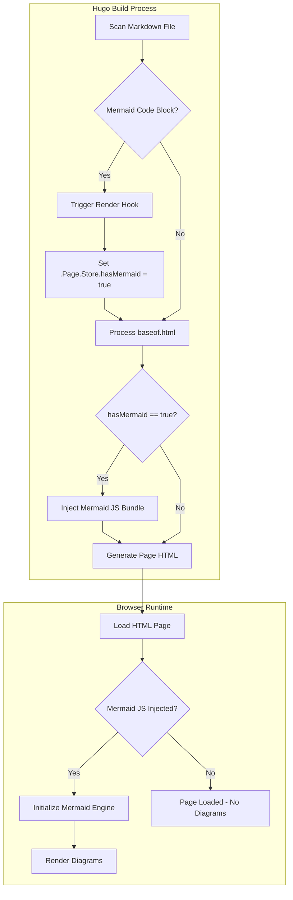
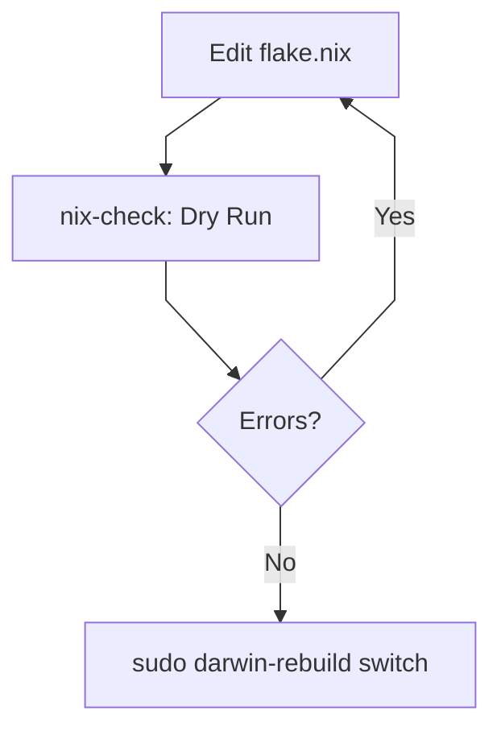

## The Friction of Creating Visuals

They say a picture is worth a thousand words, but that picture can costs thousand seconds.  For a long time, my workflow involved tools like **Draw.io** or **Excalidraw**.  While powerful, I find them cumbersome. Every minor change, like adding a node, moving a connector, or updating a label, requires manual "pixel pushing."

As someone who values **Infrastructure as Code (IaC)** and declarative systems like Ansible, Nix, etc, this manual overhead was a turn off.  The friction of creating diagrams caused me to not create them, even if they could explain better or easier then words could.  I needed a solution that treated diagrams like code: version controlled, easily amendable, and rendered automatically.  Enter **[Mermaid.js](https://mermaid.js.org)**.

> 
> ## The Vision: Diagrams as Code
> {.one}

Mermaid would allow me to create diagrams using a simple, Markdown like syntax. It gels well with a developer mindset workflow:
1.  **Efficiency:** Type your logic; the engine handles the layout.
2.  **Maintenance:** Amending a diagram is a text edit, not a redraw.
3.  **Consistency:** All diagrams share a unified aesthetic.
4.  **Fun™:** It's cool tech that’s genuinely rewarding to learn. 😎

>
> ## A Native Hugo Implementation
> {.four}

Well kind of native. Hugo doesn't have a built in a way to render mermaid code blocks in markdown.  But it has the tools built in to make it happen.

I implemented a clean, *[shortcode](https://gohugo.io/content-management/shortcodes/)* free approach using Hugo's *[Code Block Render Hooks](https://gohugo.io/render-hooks/code-blocks/)*.  This allows me to use standard Markdown using a `mermaid` [fenced code blocks](https://gohugo.io/content-management/syntax-highlighting/#fenced-code-blocks) in my documents.

### 1. The Render Hook
Create a render hook in the Hugo directory located at:
`layouts/_default/_markdown/render-codeblock-mermaid.html`:

```html
<pre class="mermaid">
  {{ .Inner | htmlEscape | safeHTML }}
</pre>
{{ .Page.Store.Set "hasMermaid" true }}
````

This might not seem like much but the last line  is an example of Hugo's **Performance by Design** with **Atomic Script Loading**

To keep the site that it build fast, I implemented a **Build-Time Toggle** using the `.Page.Store` flag. Instead of forcing every article page it generates to load in and site visitor to download the heavy Mermaid.js library (~1MB) , Hugo performs a check during the build process and only renders the javascript code statement for pages that have mermaid code  

So when the Mermaid render-hook is triggered by a Hugo code block, it sets `hasMermaid` to `true` in Hugo's internal scratchpad.  My base template then looks for this flag:  If it exists, Hugo *injects* the JavaScript into that specific HTML file. render.  If not, the script is never even sent to the browser.  This means that the overhead of diagramming is only "paid for" on the pages that use it.

### 2. Applying Hugo Logic
As with most things, there are many ways to achieve the a successful outcome, some 'more correct', some faster and others just personal choice...welcome to the way creating a Hugo site.

My personal choice, and the method outlined in the [Hugo Documentation](https://gohugo.io/content-management/diagrams/#mermaid-diagrams) was to include the following snippet into my layouts/\_defaults/baseof.html file
```go-html-template
{{ if .Page.Store.Get "hasMermaid" }}
  <script type="module">
    import mermaid from 'https://cdn.jsdelivr.net/npm/mermaid@10/dist/mermaid.esm.min.mjs';
    mermaid.initialize({ startOnLoad: true,
      theme: 'base',
      themeVariables: {
        /* Main Background and Text */
        darkMode: false,
        background: '#b4befe',      // Mocha Base
        primaryColor: '#89b4fa',    // Mocha Blue (Headers/Nodes)
        primaryTextColor: '#11111b', // Mocha Crust (Contrast for text inside nodes)
        primaryBorderColor: '#89b4fa',

        /* Secondary Elements */
        secondaryColor: '#fab387',  // Mocha Peach
        tertiaryColor: '#b4befe',   // Mocha Lavender

        /* Lines and Arrows */
        lineColor: '#cdd6f4',       // Mocha Text
        arrowheadColor: '#f5e0dc',  // Mocha Rosewater

        /* Text on the background (Labels) */
        //mainBkg: '#1e1e2e',
        nodeBorder: '#89b4fa',
        //clusterBkg: '#313244',      // Mocha Surface0 (For grouped areas)
        clusterBorder: '#45475a',   // Mocha Surface1
        titleColor: '#f5e0dc',
        //edgeLabelBackground: '#1e1e2e'
      }
    });
```
***Understanding the Logic Flow***
In Hugo’s architecture, the `baseof.html` file serves as the master shell for every page for the site. By wrapping the Mermaid initialisation in a conditional `{{ if .Page.Store.Get "hasMermaid" }}` block, this creating a "lazy-loader".

When Hugo compiles the site, it scans each Markdown file, if there is a Mermaid code block, the render-hook created earlier flips the `hasMermaid` switch to `true` for that page. 

Hugo then sees this switch during the final render of the HTML and injects the JavaScript module directly into the page. If no diagram exists, the code is skipped entirely. 

This ensures that the browser only spends resources downloading and initialising the Mermaid engine when there is data to visualise, maintaining a lightweight article footprint

This Logic flow can be represented using a Mermaid generated flowchart:



### 3. Theming with Catppuccin
Mermaid.js has a lot of levers that can pulled to affect function and look.  The out of box experience is very good and defining just a few variable can make a big impact.  

Reading through the mermaid.js docs, I could ignore the preset looks and make the diagrams feel native to my blog, using themeVariables
[Mermaid Theme Configuration](https://mermaid.js.org/config/theming.html)

I customised the script initialisation in `baseof.html` using the **Catppuccin Mocha**palette.  This ensures that arrows, nodes, and text all align with my site’s aesthetic.

Setting `theme: 'base'` is the the important line, it tells Mermaid to ignore its built-in presets (like `dark` or `default`) and listen exclusively to my `themeVariables`.

By mapping **Catppuccin Mocha** colors to these variables, you ensure the diagram isn't just an "embed"—it's a native part of your UI. For instance, using `Mocha Crust (#11111b)` for text ensures that even on bright nodes, the readability meets high accessibility standards.

```javascript
...

mermaid.initialize({ 
    startOnLoad: true,
    theme: 'base',
    	themeVariables: {
        /* Main Background and Text */
        darkMode: false,
        background: '#b4befe',      // Mocha Base
        primaryColor: '#89b4fa',    // Mocha Blue (Headers/Nodes)
        primaryTextColor: '#11111b', // Mocha Crust (Contrast for text inside nodes)
        primaryBorderColor: '#89b4fa',

        /* Secondary Elements */
        secondaryColor: '#fab387',  // Mocha Peach
        tertiaryColor: '#b4befe',   // Mocha Lavender

        /* Lines and Arrows */
        lineColor: '#cdd6f4',       // Mocha Text
        arrowheadColor: '#f5e0dc',  // Mocha Rosewater

        /* Text on the background (Labels) */
        //mainBkg: '#1e1e2e',
        nodeBorder: '#89b4fa',
        //clusterBkg: '#313244',      // Mocha Surface0 (For grouped areas)
        clusterBorder: '#45475a',   // Mocha Surface1
        titleColor: '#f5e0dc',
        //edgeLabelBackground: '#1e1e2e'    // Mocha Surface1
    }
});

...
```
***What is the JavaScript Doing?***
When the browser loads a page with a Mermaid diagram:
1. **Hugo's Logic:** The HTML arrives with the `<script type="module">` already injected.
2. **The Import:** The browser fetches the Mermaid ESM module asynchronously.
3. **The Scan:** `startOnLoad: true` triggers a scan of the DOM for any element with the `mermaid` class.
4. **The Render:** Mermaid parses your text-based logic, calculates the geometry, and replaces the `<pre>` tag with a scalable **SVG**.

>
> ## The Result: Document Diagrams
> {.two}

Now, explaining a workflow is as simple as typing a few lines of text. For example, my **Nix-Darwin Update Cycle**:
code:
```
%%{init: {'flowchart': {'curve': 'linear'}}}%%
flowchart TD
    A[Edit flake.nix] --> B[nix-check: Dry Run];
    B --> C{Errors?};
    C -- Yes --> A;
    C -- No --> D[sudo darwin-rebuild switch];
```
render:


> [!IMPORTANT]
> **Mermaid syntax is indentation-sensitive.** When writing or copy-pasting Mermaid code and it has leading *tabs* instead of *spaces* (or mixed indentation), it will cause a parsing error.

The result is a clean, responsive diagram that lives right inside my Markdown file.  No creating and exporting PNGs, no more broken links, and no more "pixel pushing."

>
> ## My Thoughts
> {.three}

Having just started using Mermaid in documents and now having built that same functionality into my Hugo site, I feel that transitioning to Mermaid has removed the creative block that visual documentation represents to me.  By treating diagrams as code, I've aligned my blogging workflow with my other workflow philosophies that I am developing: **Declarative, Versioned, and Automated.**

I can now stop skipping the diagrams because the tools are too slow.  I can forget about drawing and create code.