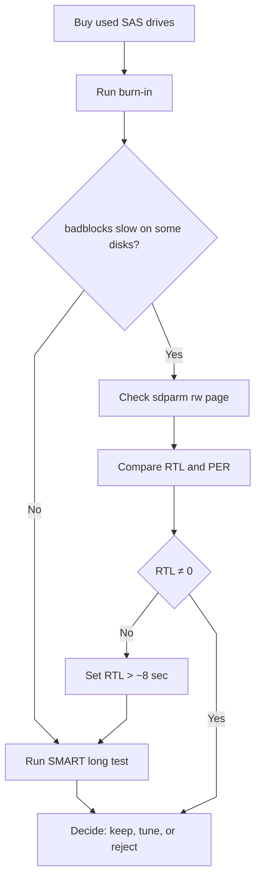
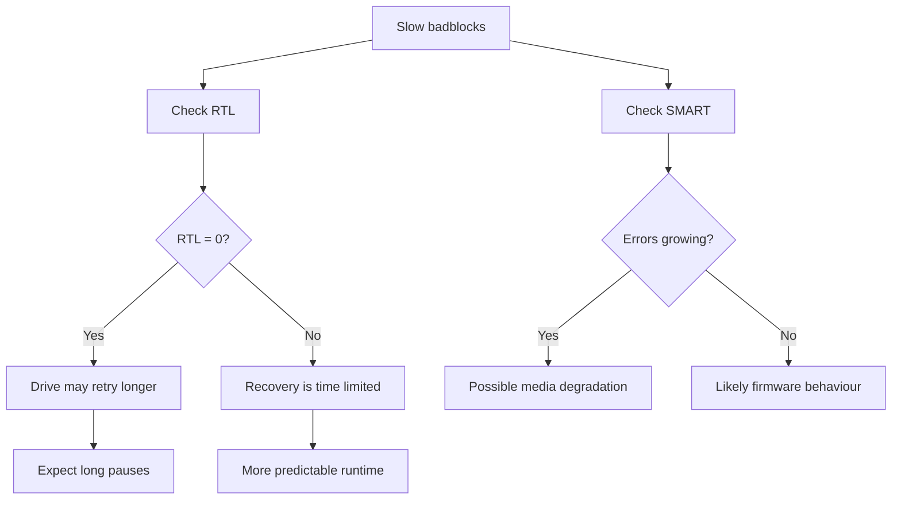

To save (a lot) of money when building out servers and services in my home lab, I buy “cheap” ex-datacenter SAS drives from eBay, I already know the deal: I'm trading money for my time and, sometimes, frustration.

The value is fantastic, enterprise grade, disks for a fraction of the cost (like AU$10-15/TB), but they don’t come plug-and-play. They come with history, quirks, and sometimes wildly inconsistent behaviour. Usually a good way to learn more about storage hardware then bargained for.

> [!info]
> The first head bang most people hit is the notorious "pin 3 power problem" 
 
My strategy is to design a reliable storage, not by investing in expensive new disk for *durability*, but by implementing *resiliency* directly at the file system level (with benefits)

Here I will go the issues I hit during a burn-in process, what I assumed was happening, what was actually happening, and how I confirmed and fixed it.

>
> ## The Issue
> {.one}

I picked up a batch of HGST 4TB SAS drives from multiple sellers and started my standard commissioning burn-in before adding them to a ZFS pool.

> [!goal]
> The goal is simple: don’t trust the disks verify them.

I kicked things off with:
```bash
badblocks -wsv -b 4096 /dev/sdX
```

Pretty quickly, something stood out.
- Some drives were progressing normally
- Others were *painfully slow*

Not slightly slower, like orders of magnitude slower...by days *s-l-o-w*. The kind of slow where you start wondering if the drive is about to fall off the perch and I just lost the ebay disk roulette.

>
> ## My Initial Assumption
> {.two}

My first thought was around error recovery.

With SATA drives, TLER (Time-Limited Error Recovery) is a known factor. Drives without it can hang for ages trying to recover a bad sector, which is bad news for RAID/ZFS.

So the assumption was:

“Maybe this is a SAS equivalent of TLER behaviour.”

That instinct wasn’t wrong—but it wasn’t the full story either.

>
> ## SAS vs SATA: The Important Difference
> {.three}

SATA drives:
- Use TLER/ERC to limit recovery time
- Often need tuning for RAID use

SAS drives:
- Use SCSI error recovery (built-in)
- Controlled via mode pages (not a simple toggle)

So yes, SAS drives already behave like TLER-enabled drives..very enterprisey.

But here’s the catch:
**The behaviour is firmware-defined, and not all SAS drives behave the same.**

>
> ## Digging Deeper with sdparm
> {.four}

To understand what was happening, I pulled the error recovery settings:

```bash
sdparm -p rw /dev/sdX
```

That’s where things got interesting.  Two key parameters stood out:
- **RTL** (Recovery Time Limit)
- **PER** (Post Error Reporting)

And suddenly, the drives split into two clear groups.

>
> ## The Defining Difference
> {.five}

Some drives had:
- RTL = 8000
- PER = 0

Others had:
- RTL = 0
- PER = 1

At a glance, they’re just numbers. In practice, they **completely** change how the disk behaves.

> 
> ## 👉 What is RTL 👈
> {.one}

RTL is the main issue here 
- RTL = 8000 → recovery is time-limited (~8 seconds)
- RTL = 0 → unlimited retries (∞ seconds)

Now think about what badblocks is doing:
- Write data
- Read it back
- Wait for the disk to respond

If the disk hits a weak sector:
- With RTL=8000 → it gives up quickly → test continues
- With RTL=0 → it retries *indefinitely* → test appears to hang

That “slow disk” wasn’t slow, it was busy trying very hard not to fail.

>
> ## What is PER (and isn't)
> {.two}

PER controls whether recovered errors are reported.
- PER = 0 → silent recovery
- PER = 1 → report recovered errors

Important detail:
**PER does not control retry time.**  
It just controls visibility.

That said, drives with PER=1 are often tuned for more aggressive recovery behaviour, which adds to the effect.

>
> ## Confirming the Diagnosis
> {.three}

To make sure this wasn’t just theory, I checked a few things.

1. Error recovery settings  
```bash
    sdparm -p rw /dev/sdX
```
2. SMART data  
```bash
    smartctl -a /dev/sdX
```
3. Behaviour under load  
    Watching how consistently the slowdown occurred

The pattern was becoming clear:
- Drives with RTL=0 were consistently slow
- Drives with RTL=8000 behaved normally

SMART data helped distinguish between:
- Firmware behaviour (clean stats, just slow)
- Actual degradation (growing defect list, errors)

>
> ## What Was I seeing
> {.four}

I could roughly interpret outcomes like this:
- Slow + clean SMART = aggressive firmware, not necessarily bad
- Slow + errors = drive is struggling, higher risk
- Fast + clean = ideal candidate for ZFS

This distinction matters, because not every *slow* disk is a *failing* disk. But it **is** a *problem* disk in a zfs pool.

>
> ## Why This Matters for ZFS
> {.five}

> [!important]
> ZFS expects disks to behave predictably.

If you mix drives with:
- Different recovery time limits
- Different retry strategies

You can end up with:
- I/O stalls
- Latency spikes
- Pool performance issues

Even if every disk is technically *healthy*.

> 
> ## Fixing the Problem
> {.one}

To all the disks in a pool behaving consistantly, I made sure they had the same recovery settings:

```bash
sdparm --set=RTL=8000 --save /dev/sdX  
sdparm --set=PER=0 --save /dev/sdX
```

After that:
- badblocks runtimes became consistent
- No more “mystery slow disks”
- Behaviour matched expectations for ZFS

> ![note] A quick note 
> Not all firmware will respect changes, so always verify after applying.

> 
> ## A Better Burn-In Process
> {.two}

After going through this, my process now looks like:
1. Destructive test (faster, still effective)
    ```bash
    badblocks -wsv -b 65536 -t 0x00 /dev/sdX
    ```
2. SMART long test
    ```bash
    badblocks -wsv -b 65536 -t 0x00 /dev/sdX
    ```
3. Review SMART data  
   ```bash
   smartctl -a /dev/sdX
   ``` 
4. Validate recovery settings  
    ```bash
    badblocks -wsv -b 65536 -t 0x00 /dev/sdX
    ```

This gives me both:
- Host-level validation (badblocks)
- Firmware-level validation (SMART)

> 
> ## Process Logic
> {.three}

Visually my logic for disk burn-in and resolving this issue  


> 
> ## (RTL) Recovery Time Limit Flow
> {.four}

Logically identify and resolving RTL issues


> 
> ## My Takeaway on This
> {.five}

Cheap ex-datacenter SAS drives are absolutely worth it. But..but only if you put the time in.

But what you’re really buying is:
- Enterprise hardware
- With unknown history
- And inconsistent firmware policies

The effort invested in testing and standardising turns them into reliable storage storage.

What looked like a batch of “slow drives” turned out to be something much more subtle:
- A firmware level mismatch in how disks handle errors.
- Once I understood that and validated it, I stopped guessing and fixed...moved on to the next task.

This is the difference between throwing disks into a pool and actually building something reliable.