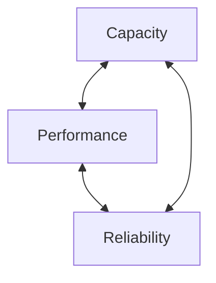
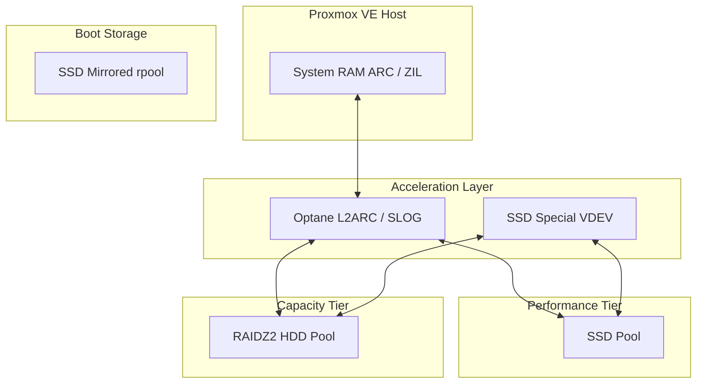

## Proxmox VE + ZFS = Practical Storage Strategy

My Proxmox VE server is more than just a hypervisor. It is also my NAS, backup target, container platform, and general-purpose infrastructure server. I cover the NAS side of this design in another article using a Samba container:  
`<<insert article link here>>`

**At the centre of this design is OpenZFS.**

ZFS is often described as a filesystem, but that description undersells what it actually is. ZFS combines:
- a filesystem
- a logical volume manager
- software RAID
- snapshotting
- data integrity verification
- replication
- caching layers
…into a single integrated software-defined storage platform.

This article is not intended to be a deep ZFS primer. The internet already has excellent documentation, benchmarks, arguments, and religious wars surrounding ZFS. Instead, this article documents the storage design strategy behind my Proxmox VE homelab, how I balance performance, reliability, and capacity, and why I made the design decisions that I did.

> ## Start With the Physical Layer
> { .one }

Before designing pools, datasets, or caching strategies, I start with the hardware itself.

These are the block devices currently installed in my server:

```bash
lsblk -d -o name,model,size,serial,id-link
```

```text
NAME    MODEL              SIZE
sda     INTEL             745.2G
sdb     INTEL             745.2G
sdc     INTEL             745.2G
sdd     INTEL             745.2G
sde     SAMSUNG           894.3G
sdf     SAMSUNG           894.3G
sdg     INTEL             745.2G
sdh     INTEL             745.2G
sdi     SAMSUNG           894.3G
sdj     SAMSUNG           894.3G
sdk     HUS726040ALS210     3.6T
sdl     HUS726040ALS210     3.6T
sdm     HUS726040ALS210     3.6T
sdn     HUS724040ALS641     3.6T
sdo     HUS726040ALS214     3.6T
sdp     HUS726040ALS214     3.6T
sdq     HUS726040ALS214     3.6T
sdr     HUS726040ALS214     3.6T
nvme1n1 Optane            260.8G
nvme0n1 BIWIN             476.9G
```

This gives me:
- 8 × 4 TB SAS HGST HDDs
- 4 × Intel enterprise SATA SSDs
- 4 × Samsung SATA SSDs
- 1 × Intel Optane NVMe device
- 1 × consumer NVMe device

> [!info]  
> Apart from the NVMe devices, these are all ex-datacenter drives. I have another article covering how I validate and monitor used enterprise drives before trusting them with production data:  
> `<<insert article link here>>`


## Why I Rejected Hardware RAID

One of the first architectural decisions I made was to avoid traditional hardware RAID controllers entirely.

Historically, hardware RAID solved several important problems:
- redundancy
- caching
- drive abstraction
- recovery workflows

Modern ZFS already handles these functions internally and expects direct access to physical disks to maintain data integrity.

Introducing a hardware RAID layer between ZFS and the disks can:
- obscure SMART telemetry
- interfere with error handling
- complicate recovery
- break end-to-end checksumming
- create controller dependency

In short, ZFS wants to manage the disks itself.

For this build, simplicity and recoverability matter more to me than maintaining legacy RAID workflows.

> ## Persistent Device Naming Matters
> { .two }

> [!danger]  
> Do not build ZFS pools using raw Linux device names like `/dev/sda`.

Linux device names can change:
- after reboots
- after HBA changes
- after moving disks between ports
- after motherboard replacement

This can make troubleshooting significantly harder and, in worst-case scenarios, complicate pool recovery.

Instead, use persistent device identifiers:
- `/dev/disk/by-id/`
- `/dev/disk/by-path/`

I prefer using WWN-based identifiers from `/dev/disk/by-id/`.

Example:
```bash
/dev/disk/by-id/wwn-0x5000cca2697d55f4
```

This has several advantages:
- identifiers remain stable across reboots
- disks remain identifiable after migration
- failed drives are easier to physically locate
- serial numbers map cleanly to ZFS fault reports

It also goes nicely with how ZFS reports degraded devices.


## Boot Pool Layout

Proxmox VE 8.x has mature and stable support for booting directly from mirrored ZFS pools.

My boot pool (`rpool`) consists of two mirrored Intel enterprise SSDs configured during installation:

```bash
zpool status
```

```text
pool: rpool
state: ONLINE

config:

    NAME                                                  STATE
    rpool                                                 ONLINE
      mirror-0                                            ONLINE
        ata-INTEL_SSDSC2BB800G4_BTWL505202K2800RGN-part3 ONLINE
        ata-INTEL_SSDSC2BB800G4_BTWL411104HV800RGN-part3 ONLINE
```

These drives are dedicated to the operating system and Proxmox VE itself, so from this point onward I largely treat them as fixed infrastructure components.

I will cover:
- mirrored boot pools
- EFI partition replication
- bootloader recovery
- rpool dataset structure
…in a separate article.

## A Minimal ZFS Primer

{ .three }

This article focuses on architecture rather than teaching ZFS fundamentals, but there are a few concepts worth defining before moving further.

### Core Concepts

- **VDEV** — A group of disks forming a redundancy layout such as a mirror or RAIDZ group.
- **Pool (`zpool`)** — One or more VDEVs aggregated into a single storage layer.
- **Dataset** — A lightweight filesystem with independent properties like compression, quotas, and snapshots.
- **ZVOL** — A block device created inside ZFS, commonly used for VM disks.
- **Special VDEV** — A high-speed metadata device used to accelerate metadata and optionally small-file workloads.

> [!warning]  
> A VDEV failure can destroy the entire pool, even if all other VDEVs remain healthy.

### Performance Layers

ZFS also includes several caching and logging layers:
- **ARC** — Primary RAM-based read cache
- **L2ARC** — Secondary cache on fast storage devices
- **ZIL** — Transaction log protecting synchronous writes
- **SLOG** — Dedicated low-latency device for accelerating synchronous writes

These layers are extremely powerful, but they also introduce complexity and tuning considerations.

That flexibility is one of the reasons ZFS is so capable in both homelab and enterprise environments.

## RAM Matters More Than Many People Expect

ZFS has a reputation for consuming enormous amounts of memory. That reputation is both true and exaggerated.

ZFS aggressively uses available RAM for ARC caching, which improves performance significantly. However, modern OpenZFS is far more memory-efficient than older recommendations suggest.

My approach is simple:
- give ZFS enough RAM to cache effectively
- avoid starving virtual machines
- monitor ARC pressure over time
- tune only when necessary

In a mixed hypervisor and NAS environment like this one, memory balance matters just as much as storage design.

> ## Architecting the Storage
> { .four }

Designing storage is always a balancing act between three competing priorities:



Every gain in one area usually comes at the expense of another.

For example:
- more parity improves resilience but reduces usable capacity
- high-performance mirror layouts consume more disks
- aggressive caching improves speed but increases complexity

The correct answer depends entirely on the workload.

## Defining My Workloads

My Proxmox VE server runs a mixture of:
- virtual machines
- LXC containers
- network storage
- backup repositories
- media services
- databases
- container infrastructure

These workloads have very different storage requirements.
Some care primarily about:
- latency
- IOPS
- synchronous write performance

Others care more about:
- raw capacity
- sequential throughput
- resilience
- long-term retention

Understanding those workload characteristics is what drives the storage design.


## Strategy Direction

At a high level, my design strategy separates:
- bulk capacity storage
- latency-sensitive VM workloads
- metadata-heavy operations
- backup and archival data

Different storage tiers will serve different purposes.

The general direction looks like this:




The next article will cover how I implement this architecture using:
- RAIDZ2 HDD layouts
- mirrored SSD VDEVs
- special metadata devices
- dataset tuning
- ZVOL configuration
- VM storage placement
- container storage strategies
- caching considerations
- snapshot and replication planning


## ZFS in Proxmox VE Already Works Extremely Well

> [!example]  
> One of the strengths of ZFS in Proxmox VE is that even a basic deployment works remarkably well out of the box.

Even without extensive tuning:

- VM provisioning works cleanly  
- snapshots are effortless
- replication is reliable
- compression is transparent
- zvol management is integrated directly into the Proxmox VE GUI

You can absolutely create a pool, deploy virtual machines, and stop there.

My goal is not to make ZFS *work*. It already does.

My goal is to understand the workload deeply enough to make the storage layout intentional rather than accidental. Many of the disadvantages to using ZFS are due to using the defaults for all work loads and the complexities in tuning it so the storage layouts are optimised for the workloads 

In future articles I will pull on the many levers that ZFS has for tuning and that is where ZFS becomes genuinely interesting.