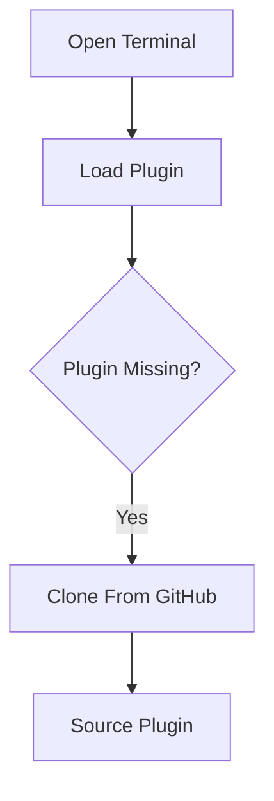
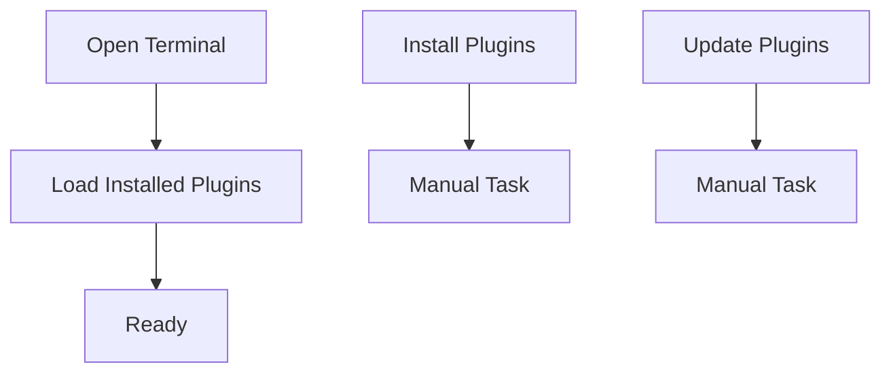

## Applying Software Engineering Principles to my Zsh

By this point in my Zsh journey, I'd organised my configuration into a modular, XDG-compliant layout and had a much better understanding of the Zsh startup lifecycle. The next logical step was to look at the code itself.

Initially, I thought this article was going to be about making my shell start faster.

It certainly became a little quicker, but that wasn't the biggest outcome.

The biggest change was learning to think differently about the code I was writing.

As I reviewed my helper functions, I realised I wasn't really writing _Zsh_. I was writing generic shell scripts that happened to run inside Zsh.

They worked perfectly well, but they weren't taking advantage of the language I'd chosen.

That became the theme for this stage of the project.

Rather than asking *"How can I optimise this?"*, I started asking a different question:

> [!QUESTION] **How would Zsh solve this problem?**

That single question changed almost every function in my configuration.

## My Plugin Loader Was a Good Place to Start

One of the first functions I revisited was my plugin loader.

Its job is straightforward.

Given a GitHub repository, install the plugin if it isn't already present, then load the appropriate plugin file.

The current version looks like this:

```zsh
function zsh_add_plugin() {
    local repo="$1"
    local plugin_name="${repo##*/}"
    local plugin_dir="$ZDOTDIR/plugins/$plugin_name"

    if [[ ! -d "$plugin_dir" ]]; then
        print "Installing $plugin_name..."
        git clone \
            "https://github.com/${repo}.git" \
            "$plugin_dir" || return 1
    fi

    zsh_add_file "plugins/$plugin_name/$plugin_name.plugin.zsh" ||
    zsh_add_file "plugins/$plugin_name/$plugin_name.zsh"
}
```

Looking at it now, there's nothing particularly complicated about it.

The interesting part is how different it is from the version I originally wrote.

## Stop Outsourcing Zsh's Work

Originally, extracting the plugin name looked something like this:

```zsh
PLUGIN_NAME=$(echo "$1" | cut -d "/" -f 2)
```

It worked.

But every time the function ran, Zsh had to:
- fork a process
- execute `echo`
- capture its output
- fork another process
- execute `cut`
- capture the result

That's a surprising amount of work just to remove part of a string.

Eventually I discovered that Zsh already knows how to do this.

```zsh
local plugin_name="${repo##*/}"
```

The expression simply removes everything before the final forward slash.


**No additional processes.**

**No pipes.**

**No external utilities.**

The shell manipulates its own data internally.

On its own, this optimisation is tiny. But across dozens of helper functions executed during startup, those tiny improvements begin to add up.

More importantly, they changed the way I think about writing shell code.

## Learning to Think Native Zsh

The more I read the Zsh documentation, the more I realised I'd been treating it as a generic Unix shell. In reality, Zsh provides an incredibly capable programming language.

Rather than immediately reaching for familiar utilities, I found myself using native language features instead.

For example:

Instead of:

```zsh
basename "$file"
```

I can simply write:

```zsh
${file:t}
```

Instead of:

```zsh
dirname "$file"
```

I can use:

```zsh
${file:h}
```

Instead of asking `ls` which completion files exist:

```zsh
ls "$plugin_dir"/_*
```

I can let Zsh's own globbing engine do the work:

```zsh
completion_files=("$plugin_dir"/_*(N))
```

I also started relying much more heavily on:
- parameter expansion
- arrays
- extended globbing
- glob qualifiers
- native conditional expressions

None of these features exist simply because they're faster. They're valuable because they let the shell solve its own problems without constantly invoking another program.

The configuration becomes shorter, easier to understand and feels much more at home in the language it's written in.

## Functions Should Protect Their Own Preconditions

Another helper function that evolved considerably was `zsh_add_file()`.

Its purpose is deliberately small.

```zsh
function zsh_add_file() {
    local file="$ZDOTDIR/$1"

    [[ -f "$file" ]] || return 1

    source "$file"
}
```

Initially, I wrote this to check whether a file existed. Now I think about it differently. 

The function establishes its preconditions first. If the file isn't there, it immediately returns. Once that condition is satisfied, every remaining line can assume the file exists. That means there is no need for nested `if` statements wrapping the rest of the function.

It also makes the function much easier to read because the important work isn't buried inside layers of conditional logic.

## Exit Codes Describe Control Flow

One of the concepts I gained a much greater appreciation for was using exit codes as part of the design.

Shell scripting already provides a simple mechanism for expressing success and failure.

Once I adopted that model, my functions naturally became smaller.

For example:

```zsh
zsh_add_file "plugins/$plugin_name/$plugin_name.plugin.zsh" ||
zsh_add_file "plugins/$plugin_name/$plugin_name.zsh"
```

The flow almost reads like English. Try the standard plugin file, if that doesn't exist, try the alternative.

There are no temporary variables.  No deeply nested conditionals just two small functions communicating through their return values.

The started to apply this thinking throughout my configuration now by applying:
- Fail early.
- Keep the function small.
- Let the return code describe what happened.

## Native Conditionals Are More Expressive

Another small change I made was replacing POSIX test expressions with native Zsh conditionals where appropriate.

Rather than writing:

```sh
[ ... ]
```

I now prefer:

```zsh
[[ ... ]]
```

Although both are built into modern shells, `[[ ... ]]` is a native Zsh construct with richer semantics.

I is a basic example of such a small change, but it avoids many of the quoting and word splitting pitfalls associated with typical test expressions while providing better pattern matching and comparison operators.

It's one of those changes that makes configuration both safer and easier to read.

## Refactoring the Startup Path

As my helper functions improved, I noticed something else. Some of the biggest opportunities weren't inside the functions at all. They were in my startup sequence.

Earlier in this series, my `.zshrc` became little more than an orchestrator.

```zsh
zsh_add_file "zsh-exports"
zsh_add_file "zsh-aliases"
zsh_add_file "zsh-vim-mode"
```

Each line simply loads one well-defined piece of functionality, the file now feels less like reading code and more like reading a table of contents.

I also began looking for expensive operations that didn't need to happen every time I opened a terminal. For example, tools like `fzf` and `zoxide` generate shell initialisation code.

Originally, that code was generated every time the shell started. Instead, I began caching the generated output and simply sourcing the cached version during startup.

The principle is simple. If something only changes when the application is upgraded, there's little value in regenerating it every time I open a terminal.

*The startup path should do the minimum amount of work necessary.*


## Demarcation in My Plugin Manager

One of the biggest improvements came from simplifying my plugin manager.

Originally, opening a terminal looked something like this.



This worked but I realised opening a terminal could unexpectedly depend on my internet connection. That didn't feel like good design.

Instead, I separated plugin management into distinct responsibilities.



Now the startup path never depends on GitHub. Network operations only happen when I explicitly request them. Each function has one clear responsibility.

Ironically, making the functions smaller also made the overall configuration much stronger.

## Questions I Now Ask

Looking back over the refactoring, I realised I was asking the same questions every time I wrote a new helper function.
- Can Zsh already solve this natively
- Am I spawning another process unnecessarily?
- Should this variable be local?
- Can I use return codes instead of more branching?
- Does this function have a single responsibility?
- Is this work really necessary during shell startup?

These become my design checklist. They're no longer specific to Zsh. I started to find myself applying this mindset whenever I write scripts in other languages too.

## Goals beyond Optimisation

Looking back, I don't think the biggest improvement was startup performance.

I now understand why my configuration is organised the way it is, why one approach is preferable to another, and how to use Zsh's own strengths rather than treating it as just another POSIX shell.

 The real outcome is a collection of helper functions that are easier to understand, easier to maintain and much closer to the language they're written in. The performance improvements are a very welcome side effect.

The more I refined my configuration, the more I realised I wasn't really building a faster shell. I was also developing and learning how to apply programming principles.